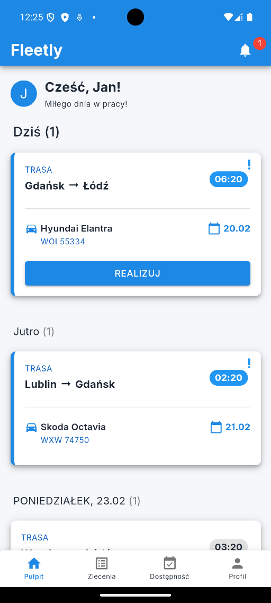
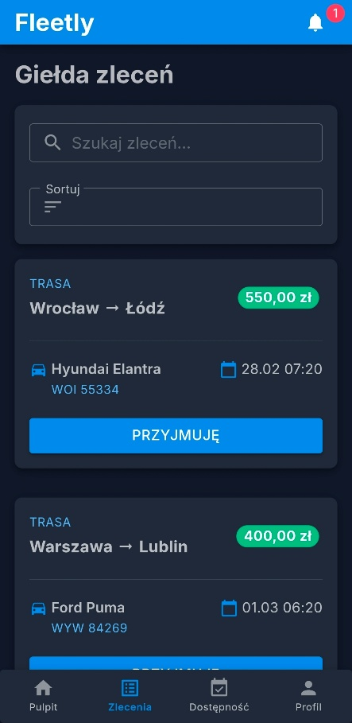
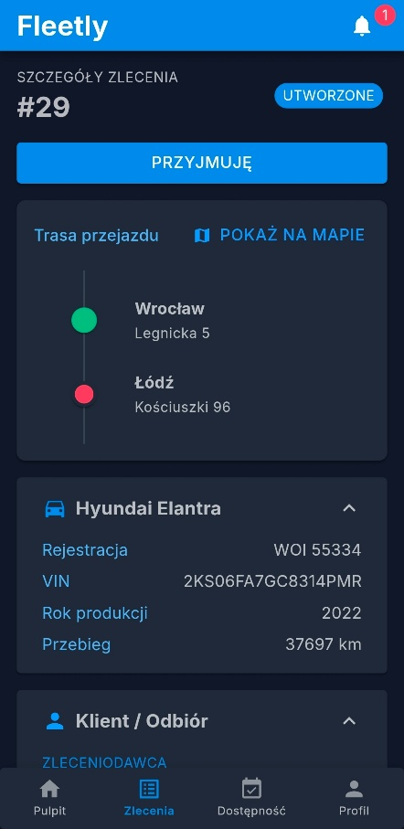
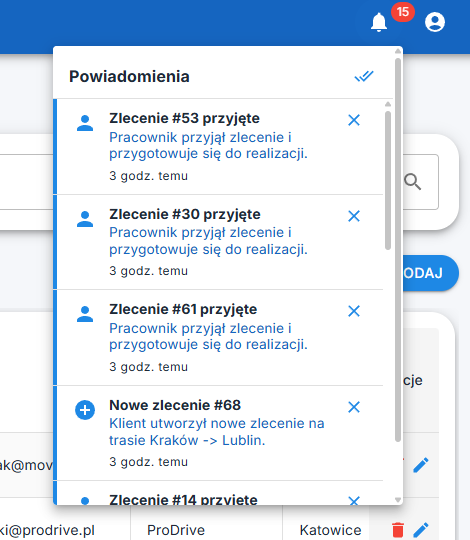

# Fleetly - Transport Order Management System

> A comprehensive, cross-platform End-to-End IT system designed to digitize fleet management, vehicle relocation processes, and electronic handover protocols. Developed as an engineering thesis, this project consists of a REST API server, a web application for administration and clients, and a dedicated mobile application for drivers.

> [!IMPORTANT]
> **Cloud Hosting Status** > The application was fully deployed and successfully hosted on the Microsoft Azure cloud environment (App Service, Static Web Apps, Azure SQL, Blob Storage) as part of the thesis defense. However, due to the expiration of my university account, the live production environment is currently offline. You can still run the entire ecosystem locally by following the instructions below.

## Key Features

### 1. Web Application (Administrators & Clients)
* **Resource Management (CRUD):** Full control over the vehicles, locations, invoices, orders, and users (Admins).
* **Order Lifecycle:** Order initialization, automated cost limit calculations, and advanced status management based on a state machine architecture.
* **Automated Route Pricing:** Integration with the OSRM mapping engine to calculate exact distances and estimate operational costs.
* **Invoicing & Payments:** Automated invoice generation and secure integration with the Stripe Checkout payment gateway (including asynchronous Webhook processing).
* **Analytics Dashboard:** Presentation of global (Admins) and individual (Clients) statistics.

### 2. Mobile Application (Drivers)
* **Job Board:** Allows drivers to browse available orders and reserve them directly to their schedule.
* **Electronic Handover Protocol:** Complete elimination of paper documentation in the vehicle pickup and drop-off process using a state machine.
* **Native Hardware Integration:** Utilizes device GPS for location verification and native camera API for photographic documentation of vehicles and their damages.
* **Media Optimization:** Image compression algorithms applied before uploading data to the cloud to save bandwidth and storage (including deletion of EXIF data without affecting image orientation).
* **Digital Signature:** Captures hand-drawn signatures from clients directly on the device's touch screen that completes the protocol (Blazored.SignaturePad).

*Note: Both apps handle login, notifications, settings for profile details, password changes, light/dark theme toggling, and notification refresh span adjustments.*

## Tech Stack

The project is built entirely on the .NET 8 ecosystem using C#.

* **Backend:** ASP.NET Core Web API
* **Database:** SQL, Entity Framework Core (Code-First approach)
* **Frontend (Web):** Blazor WebAssembly
* **Frontend (Mobile):** .NET MAUI Blazor Hybrid
* **Cloud & Hosting:** Microsoft Azure (App Service, Static Web Apps, Azure SQL, Blob Storage)
* **Security:** JSON Web Tokens (JWT), HTTPS, Secrets Management
* **Third-Party APIs:** Stripe API (Payments), OSRM (Routing & Geolocation), Google Maps API (for displaying routes in order details)

## System Architecture

The solution relies on a distributed Client-Server architecture. The core business logic is centralized within the REST API backend. Client layers communicate with the server via HTTP requests secured by JWT tokens.

By extracting the `Fleetly.Shared` project, both web and mobile applications share the exact same Data Transfer Objects (DTOs) and data validation logic, eliminating code duplication and ensuring data consistency across the entire system.

## How to Run Locally

1. Clone the repository: `git clone https://github.com/MielnickiB/Fleetly.git`
2. In the backend project folder, set up your `secrets.json` or `appsettings.json` file with your local SQL Server Connection String.
3. Apply Entity Framework migrations to generate the database using the Package Manager Console: `Update-Database`.
4. Set the API project as the startup project and run the server. *(The database will be auto-filled during the first run through the data-seeder).*
5. Run either the Web (Blazor WASM) or Mobile (MAUI) application to interact with the system.

## Screenshots

---
**Author:** Bartłomiej Mielnicki
